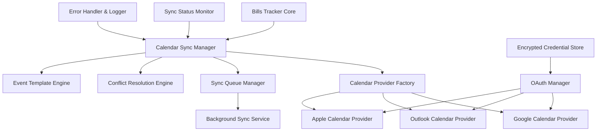
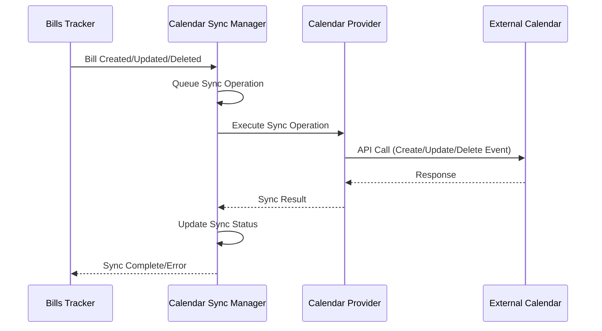

# Calendar Integration Design Document

## Overview

The calendar integration feature will extend the Bills Tracker application to synchronize with external calendar systems through their respective APIs. The system will use OAuth 2.0 authentication to securely connect with calendar providers and maintain bidirectional synchronization of bill due dates as calendar events.

The integration will be designed as a modular system that can support multiple calendar providers through a common interface, with provider-specific implementations for Google Calendar, Microsoft Outlook, and Apple Calendar (via CalDAV).

## Architecture

### High-Level Architecture



### Component Interaction Flow



## Components and Interfaces

### 1. Calendar Sync Manager

**Purpose**: Central coordinator for all calendar synchronization operations.

**Key Responsibilities**:
- Manage sync operations queue
- Coordinate with calendar providers
- Handle sync conflicts and errors
- Maintain sync status and logging

**Interface**:
```python
class CalendarSyncManager:
    def sync_bill(self, bill_id: int, operation: SyncOperation) -> SyncResult
    def sync_all_bills(self) -> List[SyncResult]
    def get_sync_status(self) -> SyncStatus
    def configure_sync_settings(self, settings: SyncSettings) -> bool
    def handle_conflict(self, conflict: SyncConflict) -> ConflictResolution
```

### 2. Calendar Provider Interface

**Purpose**: Abstract interface for different calendar providers.

**Interface**:
```python
class CalendarProvider(ABC):
    @abstractmethod
    def authenticate(self, credentials: Dict) -> AuthResult
    
    @abstractmethod
    def create_event(self, event: CalendarEvent) -> EventResult
    
    @abstractmethod
    def update_event(self, event_id: str, event: CalendarEvent) -> EventResult
    
    @abstractmethod
    def delete_event(self, event_id: str) -> EventResult
    
    @abstractmethod
    def get_events(self, date_range: DateRange) -> List[CalendarEvent]
    
    @abstractmethod
    def test_connection(self) -> ConnectionResult
```

### 3. OAuth Manager

**Purpose**: Handle OAuth 2.0 authentication flows for calendar providers.

**Key Features**:
- Provider-specific OAuth configurations
- Token refresh management
- Secure credential storage
- Authentication state management

**Interface**:
```python
class OAuthManager:
    def initiate_auth_flow(self, provider: CalendarProvider) -> AuthURL
    def handle_auth_callback(self, provider: CalendarProvider, code: str) -> AuthResult
    def refresh_token(self, provider: CalendarProvider) -> TokenResult
    def revoke_access(self, provider: CalendarProvider) -> bool
```

### 4. Event Template Engine

**Purpose**: Generate calendar events from bill data using customizable templates.

**Features**:
- Template-based event title generation
- Category-based color coding
- Custom field mapping
- Validation and fallback handling

**Interface**:
```python
class EventTemplateEngine:
    def generate_event(self, bill: Bill, template: EventTemplate) -> CalendarEvent
    def validate_template(self, template: EventTemplate) -> ValidationResult
    def get_default_template(self) -> EventTemplate
```

### 5. Sync Queue Manager

**Purpose**: Manage asynchronous synchronization operations.

**Features**:
- Operation queuing and prioritization
- Retry logic with exponential backoff
- Batch processing for efficiency
- Rate limiting compliance

**Interface**:
```python
class SyncQueueManager:
    def queue_operation(self, operation: SyncOperation) -> bool
    def process_queue(self) -> List[SyncResult]
    def get_queue_status(self) -> QueueStatus
    def clear_queue(self) -> bool
```

## Data Models

### CalendarEvent
```python
@dataclass
class CalendarEvent:
    title: str
    description: str
    start_datetime: datetime
    end_datetime: datetime
    all_day: bool
    reminders: List[Reminder]
    color: Optional[str]
    location: Optional[str]
    bill_id: int
    external_event_id: Optional[str]
```

### SyncOperation
```python
@dataclass
class SyncOperation:
    operation_type: SyncOperationType  # CREATE, UPDATE, DELETE
    bill_id: int
    calendar_provider: str
    priority: int
    created_at: datetime
    retry_count: int
```

### SyncSettings
```python
@dataclass
class SyncSettings:
    enabled_providers: List[str]
    sync_categories: List[int]
    sync_individual_bills: Dict[int, bool]
    event_template: EventTemplate
    sync_frequency: int  # minutes
    auto_sync_enabled: bool
```

### Calendar Provider Configurations

#### Google Calendar
- **API**: Google Calendar API v3
- **Authentication**: OAuth 2.0 with offline access
- **Scopes**: `https://www.googleapis.com/auth/calendar`
- **Rate Limits**: 1,000 requests per 100 seconds per user

#### Microsoft Outlook
- **API**: Microsoft Graph API
- **Authentication**: OAuth 2.0 with Microsoft Identity Platform
- **Scopes**: `https://graph.microsoft.com/calendars.readwrite`
- **Rate Limits**: 10,000 requests per 10 minutes per application

#### Apple Calendar (CalDAV)
- **Protocol**: CalDAV (RFC 4791)
- **Authentication**: App-specific passwords
- **Endpoint**: `https://caldav.icloud.com`
- **Limitations**: Requires iCloud account and app-specific password

## Error Handling

### Error Categories

1. **Authentication Errors**
   - Token expiration
   - Invalid credentials
   - Revoked access
   - Provider service unavailable

2. **Sync Errors**
   - Network connectivity issues
   - API rate limit exceeded
   - Calendar not found
   - Event creation/update failures

3. **Data Validation Errors**
   - Invalid event data
   - Template parsing errors
   - Date/time format issues
   - Missing required fields

### Error Handling Strategy

```python
class ErrorHandler:
    def handle_auth_error(self, error: AuthError) -> ErrorAction
    def handle_sync_error(self, error: SyncError) -> ErrorAction
    def handle_validation_error(self, error: ValidationError) -> ErrorAction
    def log_error(self, error: Exception, context: Dict) -> None
```

### Retry Logic
- **Exponential Backoff**: Start with 1 second, double each retry up to 300 seconds
- **Max Retries**: 5 attempts for transient errors
- **Permanent Failures**: No retry for authentication or validation errors

## Testing Strategy

### Unit Tests
- Calendar provider implementations
- Event template generation
- OAuth authentication flows
- Sync operation processing
- Error handling scenarios

### Integration Tests
- End-to-end sync workflows
- Multiple calendar provider scenarios
- Conflict resolution testing
- Performance under load
- Network failure recovery

### Mock Testing
- Calendar API responses
- OAuth authentication flows
- Network connectivity issues
- Rate limiting scenarios

### Test Data
- Sample bills with various configurations
- Mock calendar events
- Authentication tokens and responses
- Error scenarios and edge cases

## Security Considerations

### Credential Storage
- **Encryption**: AES-256 encryption for stored tokens
- **Key Management**: Separate encryption keys per user
- **Token Rotation**: Automatic refresh token rotation
- **Secure Deletion**: Proper cleanup when disconnecting accounts

### API Security
- **HTTPS Only**: All API communications over HTTPS
- **Token Validation**: Validate tokens before each API call
- **Scope Limitation**: Request minimal required permissions
- **Error Sanitization**: Avoid exposing sensitive data in error messages

### Privacy Protection
- **Data Minimization**: Only sync necessary bill information
- **User Control**: Granular control over what data is synced
- **Audit Logging**: Track all sync operations for transparency
- **Data Retention**: Clear policies for calendar event cleanup

## Performance Optimization

### Sync Efficiency
- **Batch Operations**: Group multiple operations when possible
- **Delta Sync**: Only sync changed bills since last sync
- **Intelligent Scheduling**: Sync during low-usage periods
- **Caching**: Cache calendar metadata to reduce API calls

### Rate Limit Management
- **Request Throttling**: Respect provider rate limits
- **Queue Management**: Prioritize critical operations
- **Backoff Strategies**: Implement provider-specific backoff
- **Monitoring**: Track API usage and adjust accordingly

### Database Optimization
- **Sync Status Indexing**: Index sync-related fields
- **Efficient Queries**: Optimize bill retrieval for sync
- **Connection Pooling**: Manage database connections efficiently
- **Cleanup Procedures**: Regular cleanup of old sync logs

## Configuration Management

### User Settings
```python
class CalendarSyncConfig:
    # Provider settings
    enabled_providers: Dict[str, bool]
    provider_credentials: Dict[str, EncryptedCredentials]
    
    # Sync preferences
    sync_all_bills: bool
    sync_categories: List[int]
    sync_individual_bills: Dict[int, bool]
    
    # Event formatting
    event_title_template: str
    event_description_template: str
    use_category_colors: bool
    event_duration_minutes: int
    
    # Sync behavior
    auto_sync_enabled: bool
    sync_frequency_minutes: int
    sync_on_bill_change: bool
    
    # Conflict resolution
    default_conflict_resolution: ConflictResolutionStrategy
```

### System Configuration
```python
class SystemCalendarConfig:
    # API configurations
    google_client_id: str
    google_client_secret: str
    outlook_client_id: str
    outlook_client_secret: str
    
    # Rate limiting
    max_requests_per_minute: Dict[str, int]
    retry_delays: List[int]
    
    # Performance
    max_batch_size: int
    sync_timeout_seconds: int
    max_concurrent_syncs: int
```

This design provides a robust, scalable foundation for calendar integration that can handle multiple providers, maintain data consistency, and provide a smooth user experience while respecting the constraints and capabilities of each calendar system.